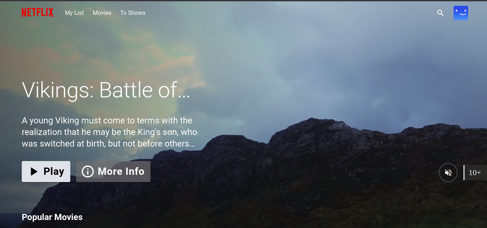

<div align="center">
  <a href="http://netflix-clone-with-tmdb-using-react-mui.vercel.app/">
    
  </a>

  <h3 align="center">Netflix Clone Project</h3>

<details>
  <ol>
    <li>
      <a href="#prerequests">Prerequests</a>
    </li>
    <li>
      <a href="#which-features-this-project-deals-with">Which features this project deals with</a>
    </li>
    <li><a href="#third-party-libraries-used-except-for-react-and-rtk">Third Party libraries used except for React and RTK</a></li>
    <li>
      <a href="#contact">Contact</a>
    </li>
  </ol>
</details>

<br />

<div align="center">
  
  <p align="center">Home Page</p>
</div>

## Prerequests

- Create an account if you don't have on [TMDB](https://www.themoviedb.org/).
  , get your API KEY and add it to your Jenkins as a Secret .
- install Helm v3 on our node
- Run the `ngrok` tool to establish a tunnel between localhost and the public network.
- Provide parameters to Jenkins:
   - GitHub username.
   - GitHub token.
   - Credential-ID = github.
   - DockerHub username.
   - DockerHub password.
   - Credential-ID = docker-cred.
   - create a secret file with TMDB and credential-ID = TMDB_V3_API_KEY
3. Create a 'prod' namespace.
4. At CI job check 
      GitHub hook trigger for GITScm polling
      This project is parameterized >> secret name:tmdb default-value:TMDB_V3_API_KEY
5. At CD job check
      This project is parameterized >> string name : GIT_COMMIT_REV

## Install with Docker

```sh
docker build --build-arg TMDB_V3_API_KEY=your_api_key_here -t netflix-clone .

docker run --name netflix-clone-website --rm -d -p 80:80 netflix-clone
```

### CI/CD Workflow:

1. Push changes to the GitHub repo (`Netfilx-Clone-CI`).

2. GitHub webhook triggers the "Netfilx-clone-CI" job, executing the Jenkinsfile.

3. CI Jenkinsfile stages:
   - Clone the git repo.
   - Build the Dockerfile and name the image `dockerhub-accountname/netfilx-clone:<commit-number>`
      and give it the TMDB_API_KEY as a secret credential
   - Push the Docker image to the DockerHub Registry.
   - make a unit test to make sure trivy is running on the node
   - run TRIVY scannner to scan docker image and give us a report at ./trivy-image-<commit-number>
   - Trigger "Netfilx-clone-CD" job and pass the commit number as a parameter.

4. "Netfilx-clone-CD" job Jenkinsfile:
   - Run `artifact_version_update` to change the deployment.yaml file with the newer image version containing the last commit number.
   - Push the updated deployment.yaml file to the GitHub repo (`Netfilx-clone-CD`).

5. ArgoCD is triggered, deploying the application to the 'prod' namespace.

6. To obtain ArgoCD IP
```
 kubectl get pods -n argocd -o wide |grep argocd-server
```
   - Then Open in your browser Pod-IP:80 <port specified in the pod definition file>
   - username : admin
   - Password : `kubectl -n argocd get secret argocd-initial-admin-secret -o jsonpath='{.data.password}' | base64 -d`
  
7. create an Application and provide the (`Application.yaml`) file and it will runs automatically when it gets triggered .

8. Open in your browser and view the result.
     ```
     http://localhost:30007/
     ``` 
     `If it's a black screen with no content  then use VPN and reopen page`

9. To monitor Node We use Prometheus and Grafana using Helm
   Run the Following commmands
    ```
    helm repo add prometheus-community https://prometheus-community.github.io/helm-charts
    helm repo add grafana https://grafana.github.io/helm-charts
    helm repo update
    helm install prometheus prometheus-community/prometheus
    kubectl edit svc prometheus-server >> make it's type NodePort on 30002
    helm install grafana grafana/grafana
    kubectl edit svc grafana >> make it's type NodePort on 30001
    ngrok http http://localhost:30002
    ```
10. Open in your browser

    ```
    http:localhost:30001
    username: admin
    password: `kubectl get secret grafana -o jsonpath='{.data.admin-password}'| base64 --decode`
    add data source >> prometheus >> copy prometheus URL from Ngrok
    import dashboard ID = 1860

    ```    
    

